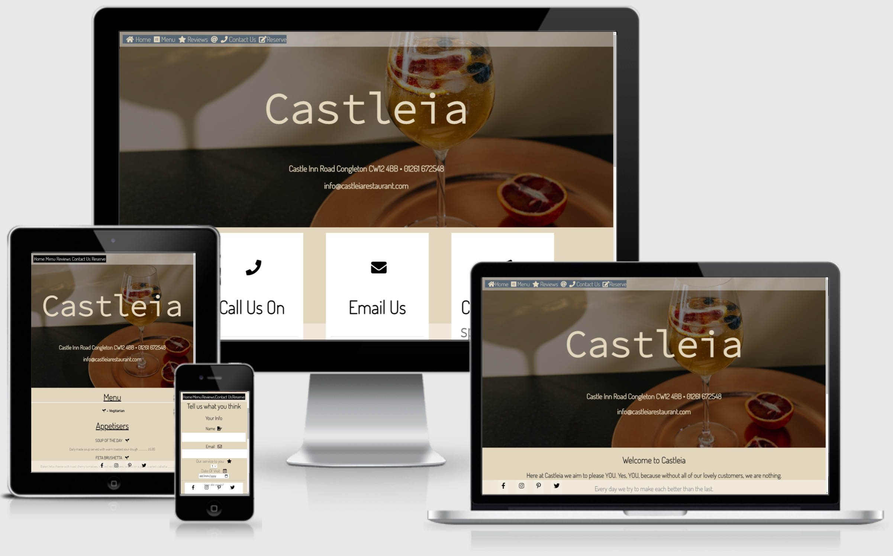
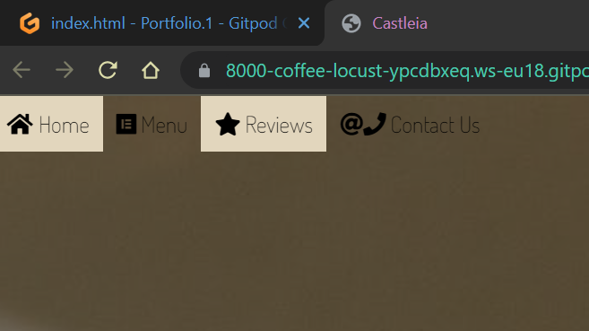
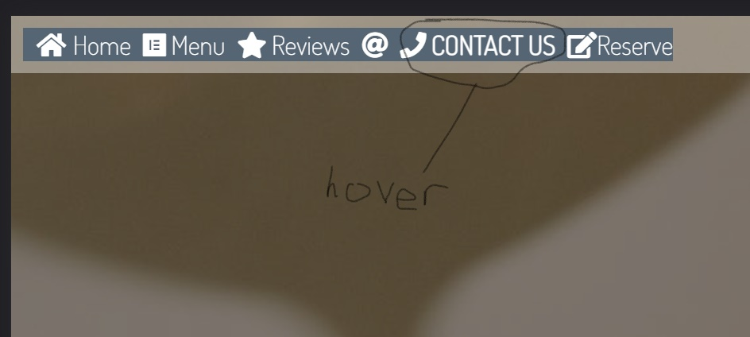

# Castlia 
Castlia is a restaurant that I have plucked out of thin air, to make this restaurant a reality I have created a user-friendly website. As Castlia is a professional place to visit I wanted to create a sleek, smart and professional layout to match the quality.  

## Project Aims 
Before even thinking about what HTML and CSS I was going to be using I needed to think of a few items:
1. Business type
2. Target Audience
3. Site Aims 
4. Color Scheme 
5. Navigation

### Business Type 
- Restaurant, I chose to go down the restaurant path purely because I've been in the hospitality industry for 7 years myself and chose this giving myself the advantage of content for the site. 
- As I said being in the industry I know what the competition is, I know what the users what and desire on a restaurants site 
- Customers expect, simple but yet elegancy, the better looking and organised website the higher the chance of them getting a better experience at the venue
### Target Audience
- My target audience is quite broad from; families to businesses and groups of friends, the easier the interaction and navigation the longer the user will choose to stay on the site and be more likely to return and book a table and if not to share to their peers. 
- Users that are looking for a new place to dine out who just want to see what information they need ie; booking a table, seeing the menu without having to complete a maze to find and all the needed information to get in touch if need be or even find us on a map. 

### Site Aims 
- When creating my site I wanted users to be aesthetically pleased
- I wanted the customer to not be confused and redirect to another restaurant site
- To offer the user an easy to navigate and accessible experience across what ever device they desire to use 
### Color Scheme 
 - When deciding the color scheme I wanted to make the site look smart and fresh as well as professional, to do this I stuck to two main colors one of which is #e2d6bd as the background and #F5F5F5 as the navbar color along with styles for hover: . 

## Features that are used across the site
To keep the professionalism of the site I kept certain features the same across each page this also makes navigating around easier for the user. 

---

 **Navbar**
The Navbar appears on all pages, it has interactive links to all pages, home, menu, contact us and review. To make the user understand which page they are currently on I used a class of "active" to change the background color of the active page. To add to the user experience I implemented a :hover function, so when the user hovers over each page the background color is changed. For the media query of (Max-width: 620px;) I removed the :hover function so the hero image text was overlapped with the background color.
Update - 16/11/2021 I have made the nav bar have bigger font and changed the text color to make the contrast better when the user is scrolling.

Throughout testing and hearing feedback I learned that my nav bar color scheme wasnt very user friendly and didnt contrast so well, I needed a new navbar so below I will display it. 

After twiddling and adjust my navbar i found a contrast that worked for all devices to make the navbar keep the profesinal feel and look. When users are using a desktop with the hover function it looks like such: 

 

  **Hero Image** 
The hero image is shown at the top of each page (below the nav), by continuing to show the hero image across each page it creates a familiar feel for the user and reminds them of which restaurant they're visiting. To further increase the user experience I have placed text within the hero image which is sat on top, the information within this text makes it possible for the user to have all info on one page if needs be. Upon loading into each page the hero image has a zoom effect, to essentially show off the brand of which is Castleia and force them to notice it and its surrounding elements.
  
   

**Footer**
I placed the footer at the bottom of my site mirrored with the navbar to keep consistancy across all pages, I used only icons for the footer, Facebook, Twitter, Instagram and Pinterest, again all icons were taken from Font awesome. I made a hover effect for these icons with text and box shadows 

`code`
 .footer-main :hover {
    font-size: 40px;
    color: #e2d6bd;
    box-shadow: 0 0 5px #e2d6bd;
    text-shadow: 0 0 5px black;
} 

## Icons and Font use 
Across the site i have used two fonts:
 -  Source Code Pro  [Google fonts](https://fonts.google.com/)
 -  Dosis [Google fonts](https://fonts.google.com/)
I used these two fonts as they compliment each other quite well and keep to my style of simple, professinal  and elegant. 
All of the fonts I used were sourced from Google Fonts.

Across the site i used many icons to make the site work for all auidinces aswell as making navigation easier. 
All icons I used were from Font Awesome. [FontAwesome](https://fontawesome.com/)

# Individual Page Content

## Home Page content
- As this is the first page the user loads into i needed to make it look classy and appealing. 
- I typed up phrases to make the customer feel good, i also used capitalization on the word "you" to grab the users attention and involve them within the site.
- I've includede three seperate images to catch the users attention by making them bright and related to the content written above, i used style to have them all line up next to rach other with the same zoom effect that i used on the hero image.
 

## Menu Page
- The layout of this page was crucial, although it isnt packed with images, videos and links, the purpose of the site entirety is to get the customers falling in love with the food. To make them purley fall in love with food, i've centered the entire menu and made it easier to read with different header elements. 
- This page also uses icons to display that different dierty needs are met, making the site more applicable for a wider range of user.

## Review page
-On this page I made the content read left to right so the user is drawn to filling in the review form. 
-I used placeholders for each form input type to make the users experince easier. 
-Each field is reuqested to put a stop to false infomation being inputed. 

                    

